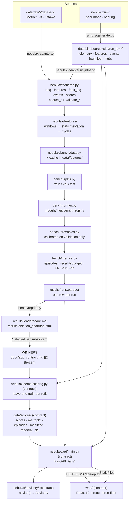

# Architecture

This document records the original Fleet twin design. The current research data and benchmark
contain only axle bearing and brake air supply. Cranfield and synthetic Door research data and
results were removed; the separate scored PS3 Door workflow remains in the app. A fresh checkout
uses `demo_data/` for a compact two-train replay, while the full local research data stays under
ignored `data/`.

How data moves from a simulator or a raw download to a pixel in the demo. Anything marked
**(contract)** is specified in `docs/app_contract.md` and had not been seen running when this
document was written: `nebulax/demo/`, `nebulax/api/`, `nebulax/advisory/`,
`scripts/score_for_demo.py` and the React app were landing in parallel, `data/scores/` did not
exist yet and no server had been started. The code is on disk; the behaviour below is the
contract, not an observation.

## 1. Data flow

Two things this diagram is asserting:

* **Everything crosses `nebulax/schema.py`.** Simulators and real adapters emit the same five
  table shapes, so the feature pipeline, the benchmark and the demo never branch on source.
* **The demo does not re-select models.** It reads the frozen winners out of
  `results/runs.parquet` by key and fails loudly if the row is missing or not `status=ok`.
  The leaderboard is the only place a model is ever chosen.

## 2. The schema tables

`nebulax/schema.py` is the frozen contract. Timestamps are **timezone-aware UTC**
(`datetime64[ms, UTC]`) everywhere, and `coerce_long`, `coerce_features`, `coerce_fault_log`,
`coerce_events`, `coerce_scores` are the only sanctioned way to build one of these frames.

### Long telemetry — `LONG_COLUMNS`

One row per sample per signal. Written as parquet + zstd, partitioned by `source` / `run_id`.

`timestamp` (ts) · `source` (cat) · `run_id` (cat) · `train_id` (cat) · `car` (int8) ·
`subsystem` (cat) · `component_id` (cat) · `signal` (cat) · `value` (float32)

### Features — `FEATURE_KEY_COLUMNS` + `LABEL_COLUMNS` + `meta_*` + the features themselves

One row per cycle (door, pneumatic compressor cycle) or per window (bearing, `window_stats`).

* Keys: `run_id, source, train_id, car, subsystem, component_id, cycle_id, t_start, t_end`.
* Labels (optional at write time, sim and labelled datasets only): `fault_type`, `severity`,
  `rul_s`, `is_faulty`, `alarm_window_3d`.
* **`meta_*` columns describe the sample but are never model inputs** — class labels,
  condition ids, severity stages, latent ground-truth counters, grouping ids.
  `feature_columns(df)` returns everything that is not a key, not a label and not `meta_*`,
  and the benchmark builds `X` from exactly that list. Leave-one-out group ids are read from
  `meta_*` or key columns, never from `X`.

### Fault log — `FAULT_LOG_COLUMNS`

Ground truth, one row per injected or documented fault:
`run_id, train_id, car, subsystem, component_id, fault_type, t_onset, t_failure,
t_functional_failure, gamma, shape, params_json`.

### Event log — `EVENT_LOG_COLUMNS`

`run_id, timestamp, train_id, car, subsystem, component_id, event, detail_json` — door
obstructions, compressor starts, depot stops and the rest of `schema.EVENT_TYPES`.

### Scores — `SCORES_COLUMNS`

What the demo consumes, one row per scored feature row:
`timestamp, train_id, car, subsystem, component_id, model, score, threshold, alert,
top_signals_json`.

Vocabularies live in the same module: `SIGNAL_SPECS` / `SIGNALS` (per subsystem, MetroPT-3
names verbatim including the `DV_eletric` typo), `FAULT_TYPES`, `EVENT_TYPES`,
`DEGRADATION_SHAPES`, and the component ids — `door_L1..L4` / `door_R1..R4` per car,
`apu_1`, `axlebox_1L..4R`, with `MAX_CAR = 6` and `car = 0` meaning unit level.

## 3. The benchmark

`configs/core.yaml` (the concatenation of `metropt_core`, `cranfield_core`, `ottawa_core`,
`synth_core`) expands into run specs. Each spec is one
`(dataset, subsystem, model, input_kind, window, feature_set, train_regime, split, peer_norm,
contamination, data_kwargs)` combination, hashed to a `config_hash`.

For each spec the runner: loads the dataset through `bench/data.py` (feature cache in
`data/features/`), cuts train/validation/test with `bench/splits.py`, fits the model on the
training slice, **calibrates the threshold on the validation slice only**
(`bench/thresholds.py`), scores the test slice, and computes episode-level metrics
(`bench/metrics.py` — alarm episodes, `recall@budget`, false alarms per scored day, lead
time, plus VUS-PR from the vendored `bench/vus_tsb_ad.py`). One parquet row per run lands in
`results/runs/<config_hash>.parquet`, all rows are combined into `results/runs.parquet`, and
`bench/report.py` renders `results/leaderboard.md` and `results/ablation_heatmap.html`.

Re-running is cheap: a spec whose `<config_hash>.parquet` exists is skipped unless
`--no-skip-existing`, and `--report-only` rebuilds the leaderboard without running a model.

## 4. Demo scoring — from leaderboard row to `data/scores/` **(contract)**

`nebulax/demo/scoring.py` holds `WINNERS: dict[str, WinnerSpec]` keyed `door`, `pneumatic`,
`bearing`, `metropt3`, each resolved against `results/runs.parquet` by
`(dataset, dataset_subsystem, model, input_kind, window, peer_norm)`.

For the sim fleet the protocol is **leave-one-train-out**: for train `Tk` the winner is fitted
on the healthy rows of the other nine trains (same `train_regime=normal_only` the benchmark
used, with its own validation carve for the threshold), then scores every row of `Tk`. Ten
fits per subsystem. The threshold is the false-alarm-budget threshold, calibrated with
`nebulax.bench.thresholds.calibrate` exactly as the benchmark does.

`alert` is not "score above threshold": it means the row belongs to an **alarm episode**
(`nebulax.bench.metrics.episodes` — above threshold for ≥ 3 consecutive rows in time on one
series, merged under a 1 h gap). A single row above threshold is `alert=False` and the UI
renders it as `warn`. `top_signals_json` carries at most 5 `{signal, z, value}` items ordered
by |z|, where `z` is the robust (median/MAD) z-score of that feature against the fitted
training distribution.

Outputs under `data/scores/`: `scores.parquet` (all three sim subsystems),
`metropt3.parquet` (the `MP3` unit on the benchmark's test slice from 11 Apr),
`episodes.parquet` (one row per alarm episode, joined to the fault log — `matched` when the
episode overlaps `[t_onset − H, t_failure]` with H = 72 h), `manifest.json` (per subsystem:
config hash, model, params, thresholds per held-out train, fit seconds, rows scored, episode
counts, git rev), and `models/<subsystem>/<held_out_train>.pkl` — a picklable `FittedWinner`
so injection can re-score without refitting.

## 5. The app contract in one page **(contract)**

**Fleet.** Trains `T01`..`T10`, sim clock 2026-09-01T00:00Z → 2026-09-30T23:59Z, plus one
extra unit `MP3` (the real Porto metro APU, Feb–Jul 2020) with its own clock that the replay
never mixes with the fleet. Instrumentation is **sparse on purpose**: per train, 2 door runs
(one leaf each), 1 pneumatic run (`apu_1`, `car=0`) and 2 bearing runs (one car each, all 8
boxes). Everything else on the 6-car schematic renders as `nodata`.

**API** (`uvicorn nebulax.api.main:app --port 8000`, all routes under `/api`, JSON with
ISO-8601 UTC strings, parquet read lazily with pyarrow filters):

| route | returns |
|---|---|
| `GET /api/health` | `status`, `scores_loaded`, `n_trains`, `clock` |
| `GET /api/trains` | fleet list with `instrumented[]` and fault-log rows |
| `GET /api/train/{id}/state?ts=` | one replay frame for that train |
| `GET /api/train/{id}/component/{cid}/series` | a downsampled signal (min/max bucketing to `max_points`) |
| `GET /api/train/{id}/component/{cid}/scores` | score/threshold/alert points + latest `top_signals` |
| `GET /api/train/{id}/component/{cid}/cycle?ts=` | the nearest stored door-cycle waveform; 404 for non-doors |
| `GET /api/alerts?ts=&train=` | episodes open or closed at `ts`, each with `advisory: null \| Advisory` |
| `GET /api/kpis?ts=` | `open_alerts`, `median_lead_h`, `fa_per_train_day`, `events_detected`, `events_total` |
| `GET /api/bench/selection` | the scoring manifest + the six leaderboard selection rows as JSON |
| `WS /api/replay` | `play` / `pause` / `seek` / `speed`; frames pushed at 10 Hz wall-clock, default speed 8640 sim-seconds per wall second (1 day / 10 s) |
| `POST /api/sim/inject` · `DELETE /api/sim/inject` | inject a fault into the replay, or clear it (§6) |
| `POST /api/advisory/{episode_id}` | run and cache the LLM advisory for that episode |
| `GET /api/advisory/{episode_id}` | the cached advisory, if one has already been generated — an addition to the contract, present in `nebulax/api/main.py` |

When `web/dist` exists the API mounts it at `/`, so one process serves the whole demo.

**Replay frame** (both `WS /api/replay` and `GET /state`): `ts`, `speed`, `playing`, then
`trains[].components[]` each carrying `car, subsystem, component_id, score, threshold, alert,
health, model, top_signals`; plus `alerts[]` (episode id, window, peak score, fault type,
`lead_to_failure_h`, advisory), `kpis` and a human-readable `ticker[]`.

`health` is `crit` inside an alarm episode at `ts`; `warn` when the latest score is above
threshold with no episode yet, or above 0.8 × threshold; `ok` when scored and below;
`nodata` when the component is not instrumented — uninstrumented components are **omitted**
from `components` and the UI fills the schematic itself. The latest score is the last scored
row at or before `ts` and not older than 6 h (doors: 2 h); older than that sets
`stale: true` and `health` falls back to `ok`.

**Advisory** (`nebulax/advisory/`): `advise(alert: AlertContext) -> Advisory`, where
`Advisory` carries `summary, evidence[], likely_component, likely_fault, recommended_action,
urgency, confidence, cbm_steps` (keys `state_detection`, `health_assessment`,
`prognostic_assessment`, `advisory`), `source` and `model`. It calls `claude-opus-5`
through `client.messages.parse(..., output_format=Advisory)` with a cached system prompt, and
**falls back to a deterministic template** (`source="template"`) on a missing
`ANTHROPIC_API_KEY`, any exception or a 20 s timeout. The API calls it in a thread, so the
demo never blocks on the network.

**Web app.** Vite 8 dev server on :5173 proxies `/api` (including the websocket) to
:8000; `npm --prefix web run build` emits `web/dist` for the API to serve. `web/public/r151.glb`
is the 6-car train, built by `assets3d/build_r151.py` with one named mesh per component id.

## 6. How `POST /api/sim/inject` works **(contract)**

This is the interactive part of the demo: a judge picks a component and a fault and watches
the detector find it.

1. **Request** — `{train_id, car, component_id, fault_type, severity_ramp_days, seed?}`.
   `fault_type` must be in `nebulax.schema.FAULT_TYPES` for that subsystem; anything else is
   a `400`.
2. **Regenerate** — the corresponding simulator (`nebulax.sim.door` / `.pneumatic` /
   `.bearing`) re-runs that one component over the replay window, with the fault onset at the
   current replay `ts` (or an explicit `t_onset` in the body) and the requested severity ramp.
   The service pattern is reconstructed deterministically from `(days, train_seed, train_id)`,
   so the injected run sits on the same duty cycle as the original.
3. **Re-score** — the fitted winner for that subsystem and held-out train is loaded from
   `data/scores/models/<subsystem>/<train>.pkl` (`load_fitted`), so **no model is refitted**;
   the new feature rows go through `score_frames` and then `episodes_from_scores`.
4. **Overlay** — the result is written to an **in-memory overlay** that the replay loop and
   every GET route consult *before* the on-disk scores. Nothing under `data/` is modified, so
   `DELETE /api/sim/inject` restores the original fleet instantly.
5. **Response** — `{run_id, n_rows, episodes: [...], elapsed_s}`.

The budget is **under 60 s for a door** (30 days of one leaf at `store_every=10`); if the
machine cannot make that, the implementation shortens `days` to the remaining replay window
rather than overrunning.
